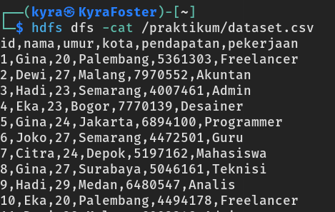
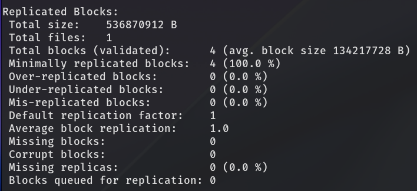
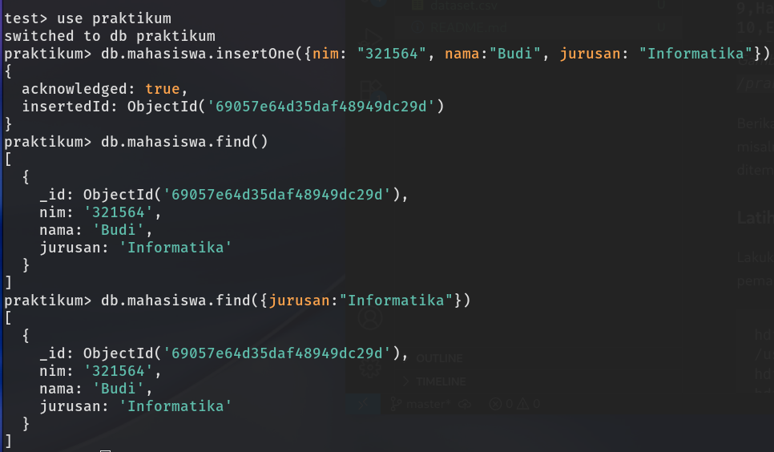
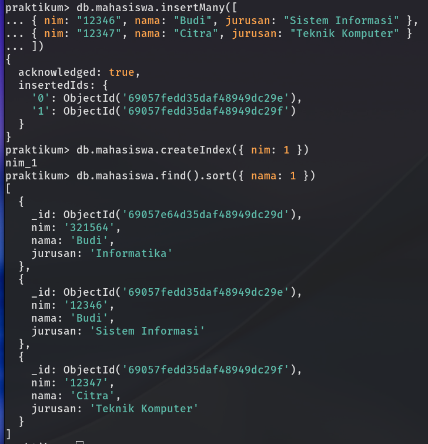
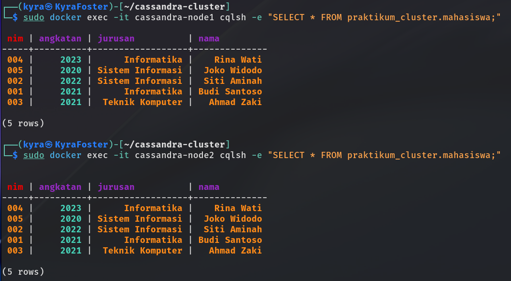
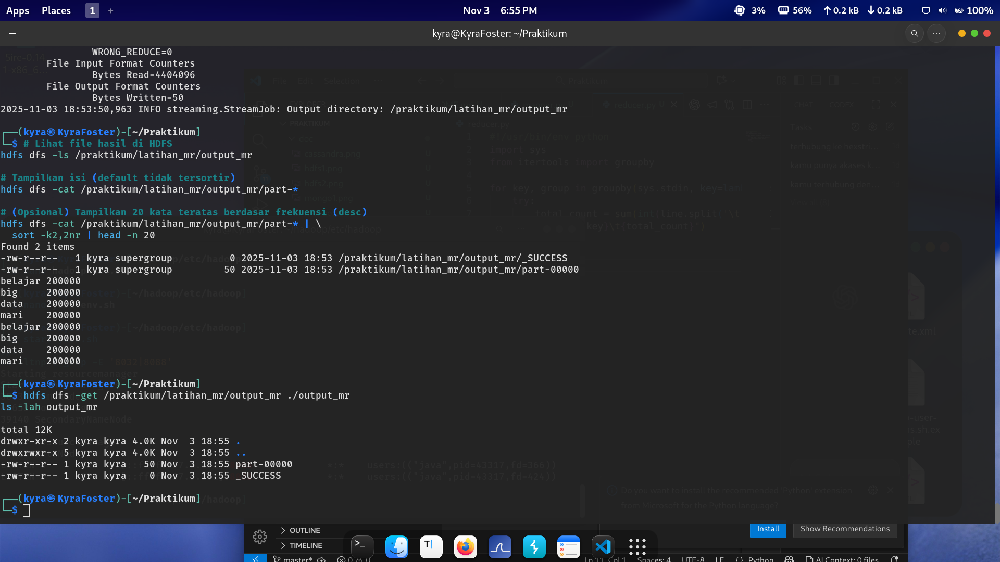
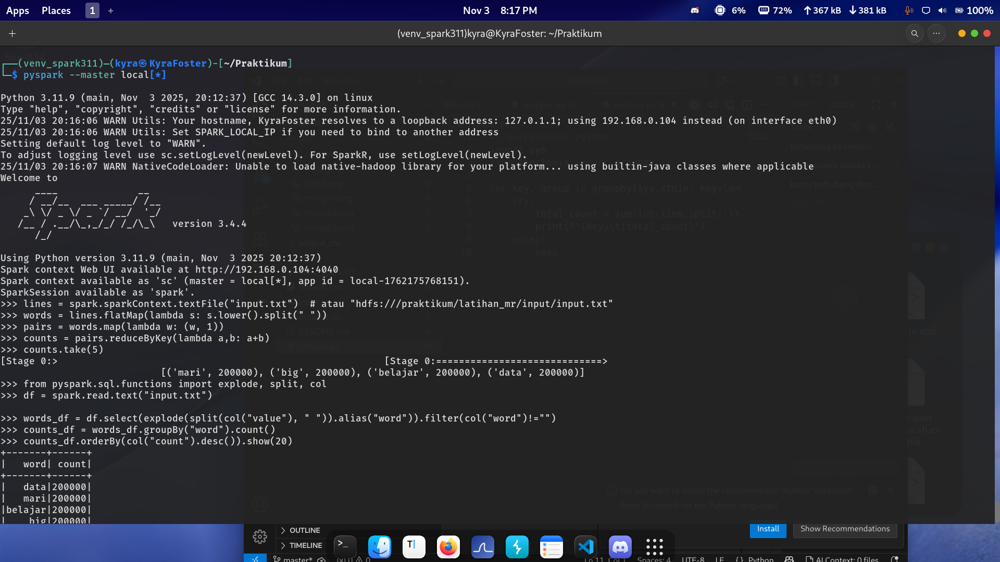

# Laporan Praktikum Big Data

## Ringkasan Tim
- **Nama Praktikan**: _Eky Fikri Yamansyah_
- **NIM**: _312310572_


## Daftar Isi
1. [Pendahuluan](#pendahuluan)
2. [Praktikum 1 – HDFS, MongoDB, Cassandra](#praktikum-1--hdfs-mongodb-cassandra)
3. [Praktikum 2 – Word Count (MapReduce, Spark RDD, DataFrame)](#praktikum-2--word-count-mapreduce-spark-rdd-dataframe)
4. [Praktikum 3 – Data Integration: Sqoop, Flume, dan Kafka](#praktikum-3--data-integration-sqoop-flume-dan-kafka)
5. [Praktikum 4 – _(sesuaikan topik)_](#praktikum-4--)
6. [Refleksi Akhir](#refleksi-akhir)
7. [Lampiran](#lampiran)

---

> **Dokumentasi**  
> - [✅] Praktikum 1 selesai
> - [✅] Praktikum 2 selesai
> - [✅] Praktikum 3 selesai
> - [ ] Praktikum 4 selesai

---

## Praktikum 1 – HDFS, MongoDB, Cassandra

### Tujuan Pembelajaran
- Memahami manajemen berkas terdistribusi menggunakan HDFS.
- Menerapkan operasi dasar NoSQL pada MongoDB.
- Mengevaluasi penyimpanan kolumnar dan query pada Cassandra.
- Membandingkan karakteristik penyimpanan ketiga teknologi tersebut.

### Kebutuhan Awal
- File lokal `dataset.csv`.
- Hadoop service aktif (`namenode`, `datanode`, dsb.).
- Layanan MongoDB dan Cassandra berjalan.
- Direktori dokumentasi gambar: `doc/` (misal `hdfs1.png`, `mongo1.png`, `cassandra1.png`).

### Bagian A – HDFS
1. **Membuat direktori praktikum di HDFS**
   ```bash
   hdfs dfs -mkdir /praktikum
   ```
   Direkomendasikan memastikan direktori belum ada dengan `hdfs dfs -ls /`.

2. **Mengunggah dataset ke HDFS**
   ```bash
   hdfs dfs -put dataset.csv /praktikum/
   ```
   Pastikan file berhasil tersalin tanpa duplikat nama.

3. **Memverifikasi isi direktori**
   ```bash
   hdfs dfs -ls /praktikum/
   ```
   Catat ukuran file dan replika yang ditampilkan.

4. **Membaca isi dataset langsung dari HDFS**
   ```bash
   hdfs dfs -cat /praktikum/dataset.csv
   ```
   Dokumentasikan potongan output penting (misal 5 baris pertama) untuk referensi.

### Dokumentasi Visual
Tambahkan bukti visual dari setiap tahapan:


_Gambar 1. Tampilan hasil `hdfs dfs -cat /praktikum/dataset.csv` atau aktivitas relevan lainnya._

Berikan penjelasan singkat mengenai insight dari gambar, misalnya struktur data, metadata direktori, atau kesalahan yang ditemukan.

### Latihan Mandiri
Lakukan eksperimen tambahan untuk memperkuat pemahaman:

```bash
hdfs dfs -put ~/bigfile.txt /user/kyymain/bigdata/
hdfs dfs -put ~/bigfile.txt /praktikum/
hdfs fsck /user/kyymain/bigdata/bigfile.txt -files -blocks -locations
```

- Jelaskan tujuan menempatkan `bigfile.txt` pada dua lokasi berbeda.
- Analisis hasil dari `hdfs fsck`, terutama informasi jumlah blok, lokasi replika, dan potensi mismatch.


_Gambar 2. Visualisasi hasil pemeriksaan integritas HDFS dengan `hdfs fsck`._

> **Catatan Analisis Gambar**  
> Terangkan apakah semua blok terdistribusi merata, apakah terdapat blok hilang/korup, dan bagaimana implikasinya terhadap ketersediaan data.

### Bagian B – MongoDB
1. **Memilih basis data kerja**
   ```javascript
   use praktikum
   ```
   Pastikan database otomatis dibuat saat perintah insert pertama dijalankan.

2. **Menambahkan data mahasiswa**
   ```javascript
   db.mahasiswa.insertOne({ nim: "321564", nama: "Budi", jurusan: "Informatika" })
   ```
   Catat acknowledgement (`acknowledged: true`) sebagai bukti keberhasilan operasi.

3. **Menambahkan beberapa data sekaligus**
   ```javascript
   db.mahasiswa.insertMany([
     { nim: "12346", na ma: "Budi", jurusan: "Sistem Informasi" },
     { nim: "12347", nama: "Citra", jurusan: "Teknik Komputer" }
   ])
   ```
   Evaluasi dampak `insertMany` terhadap throughput dan pastikan tidak ada duplikasi `nim`.

4. **Membuat indeks pada kolom NIM**
   ```javascript
   db.mahasiswa.createIndex({ nim: 1 })
   ```
   Simpan hasil pembuatan indeks (nama indeks) dan jelaskan tujuan indeks berurutan (`ascending`) pada atribut unik.

5. **Menampilkan seluruh data mahasiswa**
   ```javascript
   db.mahasiswa.find()
   ```
   Simpan output JSON beserta jumlah dokumen yang dihasilkan.

6. **Query berbasis jurusan**
   ```javascript
   db.mahasiswa.find({ jurusan: "Informatika" })
   ```
   Jelaskan bagaimana MongoDB memfilter koleksi dan potensi penggunaan indeks di masa depan.

7. **Menampilkan data terurut berdasarkan nama**
   ```javascript
   db.mahasiswa.find().sort({ nama: 1 })
   ```
   Catat perbedaan performa sebelum dan sesudah indeks dibuat, serta dampak urutan ascending terhadap hasil.

8. **Latihan: Menyimpan Dokumen Nested**
   ```javascript
   db.biodata.insertOne({
     nama: "Eky Fikri Yamansyah",
     umur: 22,
     alamat: {
       jalan: "Jl. Mawar No. 12",
       kecamatan: "Cikarang Selatan",
       kota: "Bekasi",
       provinsi: "Jawa Barat"
     },
     kontak: {
       email: "eky@example.com",
       hp: "0895-xxxx-xxxx"
     },
     hobi: ["coding", "cybersecurity", "music"]
   })
   
   db.biodata.find().pretty()
   ```
   Soroti struktur embedded document (`alamat`, `kontak`) dan array (`hobi`) serta kegunaannya untuk menyimpan data semi-terstruktur.


_Gambar 2. Tampilan shell MongoDB yang menampilkan hasil insert dan query._


_Gambar 3. Bukti pembuatan indeks dan hasil query terurut pada koleksi `mahasiswa`._


_Gambar 4. Contoh penyimpanan dokumen bersarang pada koleksi `biodata`._

> **Analisis MongoDB**  
> Jelaskan struktur dokumen yang digunakan, highlight fleksibilitas skema, serta bandingkan dengan tabel relasional/kolumnar.

### Bagian C – Cassandra
1. **Membuat keyspace praktikum**
   ```sql
   CREATE KEYSPACE praktikum
   WITH replication = { 'class': 'SimpleStrategy', 'replication_factor': 1 };
   ```
   Pastikan keyspace aktif dengan `USE praktikum;` sebelum melanjutkan ke langkah berikut.

2. **Membangun tabel mahasiswa**
   ```sql
   CREATE TABLE mahasiswa (
     nim text PRIMARY KEY,
     nama text,
     jurusan text
   );
   ```
   Gunakan `PRIMARY KEY` pada `nim` agar setiap baris memiliki identitas unik.

3. **Menambahkan data awal**
   ```sql
   INSERT INTO mahasiswa (nim, nama, jurusan)
   VALUES ('12345', 'Budi', 'Informatika');
   ```
   Verifikasi bahwa write berhasil dengan meninjau `timestamp` dan `applied` pada response.

4. **Membaca isi tabel**
   ```sql
   SELECT * FROM mahasiswa;
   ```
   Dokumentasikan hasil query beserta struktur kolom yang tampil.

5. **Eksperimen lanjutan**
   ```sql
   INSERT INTO mahasiswa (nim, nama, jurusan) VALUES ('12346', 'Citra', 'Sistem Informasi');
   INSERT INTO mahasiswa (nim, nama, jurusan) VALUES ('12347', 'Dewi', 'Teknik Komputer');
   SELECT * FROM mahasiswa WHERE jurusan = 'Informatika' ALLOW FILTERING;
   ALTER KEYSPACE praktikum WITH replication = { 'class': 'SimpleStrategy', 'replication_factor': 3 };
   ```
   Jelaskan konsekuensi `ALLOW FILTERING` terhadap performa dan kenapa sebaiknya menggunakan partisi yang dirancang sesuai pola query. Catat juga kebutuhan penyesuaian cluster sebelum menaikkan `replication_factor`.

6. **Validasi replikasi**
   - Gunakan `DESCRIBE KEYSPACE praktikum;` untuk memastikan konfigurasi baru terpasang.
   - Jika memungkinkan, rekam hasil `nodetool status` guna memantau distribusi node.


_Gambar 5. Bukti eksekusi query Cassandra dan status keyspace._

> **Analisis Cassandra**  
> Uraikan pola akses yang cocok untuk Cassandra, trade-off konsistensi, serta perbedaan mendasar dibanding MongoDB dan HDFS.

### Latihan – Cassandra 2 Node dengan Docker Compose
1. **Cek status cluster**  
   ```bash
   sudo docker exec -it cassandra-node1 nodetool status
   ```
   Pastikan kedua node (`UN` status) aktif sebelum menjalankan query.

2. **Aktifkan keyspace dengan replika ganda**
   ```sql
   CREATE KEYSPACE praktikum_cluster
   WITH replication = { 'class': 'SimpleStrategy', 'replication_factor': 2 };
   
   USE praktikum_cluster;
   ```
   Konfirmasi bahwa `replication_factor = 2` agar data tersalin ke dua node.

3. **Buat tabel dan isi data**
   ```sql
   CREATE TABLE mahasiswa (
       nim text PRIMARY KEY,
       nama text,
       jurusan text,
       angkatan int
   );
   
   INSERT INTO mahasiswa (nim, nama, jurusan, angkatan) VALUES ('001', 'Budi Santoso', 'Informatika', 2021);
   INSERT INTO mahasiswa (nim, nama, jurusan, angkatan) VALUES ('002', 'Siti Aminah', 'Sistem Informasi', 2022);
   INSERT INTO mahasiswa (nim, nama, jurusan, angkatan) VALUES ('003', 'Ahmad Zaki', 'Teknik Komputer', 2021);
   INSERT INTO mahasiswa (nim, nama, jurusan, angkatan) VALUES ('004', 'Rina Wati', 'Informatika', 2023);
   INSERT INTO mahasiswa (nim, nama, jurusan, angkatan) VALUES ('005', 'Joko Widodo', 'Sistem Informasi', 2020);
   
   SELECT * FROM mahasiswa;
   ```

4. **Amati distribusi token antar node**
   ```bash
   sudo docker exec -it cassandra-node1 cqlsh -e "SELECT nim, nama, TOKEN(nim) FROM praktikum_cluster.mahasiswa;"
   ```
   Catat nilai token sebagai indikator node penyimpanan setiap baris.

5. **Verifikasi replika di masing-masing node**
   ```bash
   sudo docker exec -it cassandra-node1 cqlsh -e "SELECT * FROM praktikum_cluster.mahasiswa;"
   sudo docker exec -it cassandra-node2 cqlsh -e "SELECT * FROM praktikum_cluster.mahasiswa;"
   ```
   Bandingkan hasil untuk memastikan data tersedia di kedua node sesuai replika yang ditentukan.


_Gambar 6. Distribusi token dan replika data pada cluster Cassandra dua node._

### Kesimpulan Praktikum 1
- Soroti temuan utama dari ketiga bagian (HDFS, MongoDB, Cassandra).
- Catat isu yang muncul di masing-masing layanan dan solusi penanganannya.
- Buat daftar rencana tindak lanjut seperti konfigurasi replikasi lanjutan atau optimasi query.

---

## Praktikum 2 – Word Count (MapReduce, Spark RDD, DataFrame)
### Ringkasan Tujuan
- Membandingkan tiga pendekatan pemrosesan data besar untuk kasus Word Count: Hadoop Streaming (MapReduce), Spark RDD, dan Spark DataFrame/SQL.
- Memahami perbedaan arsitektur, sintaks, dan performa masing‑masing teknologi.

### Requirements
- Hadoop (cluster/single‑node) + HDFS aktif.
- Apache Spark 3.x + PySpark.
- Python 3.x.
- File: `input.txt`, `mapper.py`, `reducer.py`.

### Setup Awal
1) Siapkan direktori dan unggah data ke HDFS
```bash
hdfs dfs -mkdir -p /praktikum/latihan_mr/input
hdfs dfs -put input.txt /praktikum/latihan_mr/input/
hdfs dfs -ls /praktikum/latihan_mr/input
```

2) Pastikan file mapper/reducer dapat dieksekusi
```bash
chmod +x mapper.py reducer.py
```

---

### Sesi 1 — MapReduce (Hadoop Streaming)
Gunakan skrip berikut:

`mapper.py`
```python
#!/usr/bin/env python
import sys

for line in sys.stdin:
    words = line.strip().split()
    for word in words:
        print(f"{word.lower()}\t1")
```

`reducer.py`
```python
#!/usr/bin/env python
import sys
from itertools import groupby

for key, group in groupby(sys.stdin, key=lambda x: x.split('\t', 1)[0]):
    try:
        total_count = sum(int(line.split('\t', 1)[1].strip()) for line in group)
        print(f"{key}\t{total_count}")
    except ValueError:
        pass
```

Jalankan Hadoop Streaming:
```bash
hadoop jar $HADOOP_HOME/share/hadoop/tools/lib/hadoop-streaming-*.jar \ 
  -files mapper.py,reducer.py \ 
  -input /praktikum/latihan_mr/input \ 
  -output /praktikum/latihan_mr/output_mr \ 
  -mapper mapper.py \ 
  -reducer reducer.py
```

Tips MapReduce:
- Jika output sudah ada: `hdfs dfs -rm -r /praktikum/latihan_mr/output_mr`.
- Lihat hasil: `hdfs dfs -cat /praktikum/latihan_mr/output_mr/part-*`.
- Top 20 frekuensi (desc):
  ```bash
  hdfs dfs -cat /praktikum/latihan_mr/output_mr/part-* | sort -k2,2nr | head -n 20
  ```
- Ambil ke lokal (opsional):
  ```bash
  hdfs dfs -get /praktikum/latihan_mr/output_mr ./output_mr
  ```

---

### Sesi 2 — Spark RDD
Contoh via PySpark shell:
```bash
pyspark --master local[*]
```

Script RDD:
```python
# Pilih salah satu sumber data
lines = spark.sparkContext.textFile("input.txt")
# atau: lines = spark.sparkContext.textFile("hdfs:///praktikum/latihan_mr/input/input.txt")

words = lines.flatMap(lambda s: s.lower().split())
pairs = words.map(lambda w: (w, 1))
counts = pairs.reduceByKey(lambda a, b: a + b)

# Aksi
counts.take(5)
# Simpan (opsional)
# counts.saveAsTextFile("output_rdd")
```

Catatan RDD:
- Tanpa aksi seperti `collect()`, `take()`, atau `saveAsTextFile()`, transformasi tidak dieksekusi (lazy evaluation).
- Gunakan `time` atau Spark UI (`http://localhost:4040`) untuk mengamati waktu eksekusi dan stage.

---

### Sesi 3 — Spark DataFrame/SQL
```python
from pyspark.sql.functions import explode, split, col

df = spark.read.text("input.txt")
# atau: df = spark.read.text("hdfs:///praktikum/latihan_mr/input/input.txt")

words_df = df.select(explode(split(col("value"), " ")).alias("word")).filter(col("word") != "")
counts_df = words_df.groupBy("word").count()

counts_df.orderBy(col("count").desc()).show(10)

# Bonus SQL
counts_df.createOrReplaceTempView("word_counts")
spark.sql("SELECT word, count FROM word_counts ORDER BY count DESC LIMIT 10").show()

# Lihat rencana eksekusi
counts_df.explain()
```

---

### Hasil & Analisis
Gunakan tabel berikut untuk membandingkan hasil (isi sesuai eksperimen Anda):

| Teknologi | Waktu Eksekusi | Kompleksitas Kode | Kelebihan | Kekurangan |
|-----------|----------------|-------------------|-----------|------------|
| MapReduce | _(isi)_        | Tinggi            | Reliable, mature | Lambat, verbose |
| Spark RDD | _(isi)_        | Sedang            | Fleksibel, cepat | Kurang optimasi otomatis |
| DataFrame | _(isi)_        | Rendah            | Optimisasi Catalyst, paling cepat | Kurang fleksibel untuk operasi sangat kustom |

Pertanyaan panduan:
- Mengapa MapReduce memerlukan berkas `mapper` dan `reducer` terpisah?  
  Jawab singkat: pemisahan fase Map/Reduce eksplisit dan berbasis stream.
- Apa yang terjadi jika `collect()` dihapus pada RDD?  
  Jawab singkat: tidak ada eksekusi karena lazy evaluation.
- Mengapa DataFrame terasa lebih mudah?  
  Jawab singkat: API deklaratif mirip SQL; dioptimalkan oleh Catalyst.

---

### Troubleshooting
- Permission denied `mapper.py`: `chmod +x mapper.py reducer.py`.
- Output directory exists: `hdfs dfs -rm -r /praktikum/latihan_mr/output_mr`.
- PySpark tidak ditemukan: `export PATH=$SPARK_HOME/bin:$PATH`.
- `input.txt` tidak ditemukan: verifikasi path (lokal/HDFS) dan izin akses.
- Memory error Spark: jalankan dengan `pyspark --driver-memory 4g --executor-memory 4g`.

### Bukti Eksperimen (Gambar)
Sertakan tangkapan layar hasil eksekusi pada bagian ini:


_Gambar 1. Hasil MapReduce (Hadoop Streaming) untuk Word Count._


_Gambar 2. Hasil Word Count menggunakan Spark (RDD/DataFrame/SQL)._ 

Letakkan file pada folder `doc/` dengan nama: `doc/pr1.png` dan `doc/pr2.png`.

### Checklist Praktikum 2
- [ ] MapReduce sukses, hasil diverifikasi dari HDFS.
- [ ] Spark RDD berjalan dan menyimpan/menampilkan hasil.
- [ ] Spark DataFrame/SQL menampilkan top 10 kata.
- [ ] Tabel perbandingan dan analisis terisi.
- [ ] Screenshot disimpan di folder `doc/`.

---

## Praktikum 3 – Data Integration: Sqoop, Flume, dan Kafka

### Ringkasan Praktikan
- **Nama**: Eky Fikri Yamansyah
- **NIM**: 312310572
- **Tanggal Praktikum**: _[isi tanggal]_

---

### 📋 Daftar Isi
1. [Tujuan Pembelajaran](#tujuan-pembelajaran)
2. [Kebutuhan Awal](#kebutuhan-awal)
3. [Bagian A - Apache Sqoop](#bagian-a--apache-sqoop)
4. [Bagian B - Apache Flume](#bagian-b--apache-flume)
5. [Bagian C - Apache Kafka](#bagian-c--apache-kafka)
6. [Perbandingan Ketiga Tools](#perbandingan-ketiga-tools)
7. [Kesimpulan](#kesimpulan)
8. [Troubleshooting](#troubleshooting)

---

### 🎯 Tujuan Pembelajaran

Setelah menyelesaikan praktikum ini, mahasiswa mampu:
1. Menjelaskan perbedaan fungsi dan kasus penggunaan Sqoop, Flume, dan Kafka
2. Melakukan transfer data dari MySQL ke HDFS menggunakan Sqoop
3. Mengkonfigurasi Flume agent untuk mengumpulkan data dari sumber dan menyimpannya ke tujuan
4. Membuat Kafka Topic serta mengirim (produce) dan menerima (consume) pesan

---

### 💻 Kebutuhan Awal

#### Software & Environment
- ✅ Sistem Operasi Linux (Ubuntu/CentOS) atau VM dengan Hadoop
- ✅ Hadoop (HDFS & MapReduce/YARN) sudah terinstal dan berjalan
- ✅ Java Development Kit (JDK) 8+
- ✅ MySQL Server terinstal
- ✅ Apache Sqoop sudah diunduh dan diekstrak
- ✅ Apache Flume sudah diunduh dan diekstrak
- ✅ Apache Kafka sudah diunduh dan diekstrak
- ✅ Pengetahuan dasar perintah baris Linux

#### Verifikasi Environment
```bash
# Cek Java
java -version

# Cek Hadoop
hadoop version

# Cek MySQL
mysql --version

# Cek HDFS status
hdfs dfsadmin -report
```

---

### 📦 Bagian A – Apache Sqoop

#### 🔍 Dasar Teori
Apache Sqoop adalah alat untuk mentransfer data secara efisien antara Hadoop dan penyimpanan data terstruktur seperti database relasional. Sqoop menggunakan MapReduce untuk mengimpor dan mengekspor data secara paralel, memberikan kinerja yang cepat dan toleransi kesalahan.

**Use Case:** 
- Migrasi data dari RDBMS ke HDFS
- Export hasil analisis dari Hadoop ke database
- ETL pipeline untuk data warehousing

#### 🚀 Skenario Praktikum
Mengimpor data tabel `employees` dari database MySQL ke direktori di HDFS.

---

#### Langkah 1: Persiapan Database MySQL

##### 1.1 Login ke MySQL
```bash
mysql -u root -p
```

##### 1.2 Buat Database dan Tabel
```sql
-- Buat database
CREATE DATABASE company;

-- Gunakan database
USE company;

-- Buat tabel employees
CREATE TABLE employees (
    id INT PRIMARY KEY,
    name VARCHAR(50),
    department VARCHAR(50),
    salary INT
);

-- Insert sample data
INSERT INTO employees VALUES 
    (1, 'Andi', 'IT', 5000000),
    (2, 'Budi', 'Finance', 6000000),
    (3, 'Citra', 'HR', 5500000),
    (4, 'Dewi', 'IT', 7000000),
    (5, 'Eko', 'Marketing', 6500000);

-- Verifikasi data
SELECT * FROM employees;
```

##### 1.3 Screenshot MySQL

_Gambar 1. Database company dan tabel employees berhasil dibuat._

**💡 Tips:**
- Catat username dan password MySQL Anda
- Pastikan MySQL service running: `sudo systemctl status mysql`
- Jika lupa password root: `sudo mysql_secure_installation`

---

#### Langkah 2: Setup Sqoop

##### 2.1 Download MySQL JDBC Connector
```bash
# Download MySQL Connector
wget https://dev.mysql.com/get/Downloads/Connector-J/mysql-connector-java-8.0.33.tar.gz

# Extract
tar -xvzf mysql-connector-java-8.0.33.tar.gz

# Copy JAR ke Sqoop lib directory
cp mysql-connector-java-8.0.33/mysql-connector-java-8.0.33.jar $SQOOP_HOME/lib/
```

##### 2.2 Verifikasi Koneksi Sqoop
```bash
# Test koneksi ke MySQL
sqoop list-databases \
  --connect jdbc:mysql://localhost/ \
  --username root \
  --password 'your_password'
```

**Expected Output:** Daftar database termasuk `company` harus muncul.


_Gambar 2. Verifikasi koneksi Sqoop ke MySQL berhasil._

---

#### Langkah 3: Import Data dari MySQL ke HDFS

##### 3.1 Jalankan Sqoop Import
```bash
# Import tabel employees ke HDFS
sqoop import \
  --connect jdbc:mysql://localhost/company \
  --username root \
  --password 'your_password' \
  --table employees \
  --target-dir /user/hadoop/employees \
  --m 1
```

**Penjelasan Parameter:**
- `--connect`: URL koneksi JDBC ke database
- `--username/--password`: Kredensial MySQL
- `--table`: Nama tabel yang akan diimpor
- `--target-dir`: Lokasi tujuan di HDFS
- `--m 1`: Jumlah mapper (parallel processes)

##### 3.2 Monitor Proses Import
Sqoop akan menjalankan MapReduce job. Perhatikan output:
- Map task progress
- Records transferred
- Execution time


_Gambar 3. Proses import data menggunakan Sqoop MapReduce._

---

#### Langkah 4: Verifikasi Hasil di HDFS

##### 4.1 Cek Directory di HDFS
```bash
# List directory
hdfs dfs -ls /user/hadoop/employees

# Cek isi file
hdfs dfs -cat /user/hadoop/employees/part-m-00000
```

**Expected Output:**
```
1,Andi,IT,5000000
2,Budi,Finance,6000000
3,Citra,HR,5500000
4,Dewi,IT,7000000
5,Eko,Marketing,6500000
```


_Gambar 4. Data employees berhasil tersimpan di HDFS._

##### 4.2 Analisis File Metadata
```bash
# Cek detail file
hdfs dfs -stat "%n - %b bytes - %y" /user/hadoop/employees/part-m-00000
```

---

#### Langkah 5: Latihan Export Data (HDFS → MySQL)

##### 5.1 Buat Tabel Tujuan di MySQL
```sql
USE company;

CREATE TABLE employees_backup (
    id INT PRIMARY KEY,
    name VARCHAR(50),
    department VARCHAR(50),
    salary INT
);
```

##### 5.2 Export dari HDFS ke MySQL
```bash
sqoop export \
  --connect jdbc:mysql://localhost/company \
  --username root \
  --password 'your_password' \
  --table employees_backup \
  --export-dir /user/hadoop/employees \
  --input-fields-terminated-by ','
```

##### 5.3 Verifikasi di MySQL
```sql
SELECT * FROM employees_backup;
```


_Gambar 5. Data berhasil di-export kembali ke MySQL._

---

#### 📊 Pertanyaan Analisis Sqoop (Jawaban)

1) Jelaskan alur kerja Sqoop dari database ke HDFS!
- Sqoop membuat job MapReduce; setiap mapper membuka koneksi JDBC ke MySQL, membaca subset baris (berdasar split key/primary key range), lalu menulis output ke HDFS dalam format teks/sequence. Koordinasi pembacaan dilakukan paralel sehingga throughput tinggi; reducer tidak digunakan untuk import standar.

2) Apa fungsi parameter `-m 1` dan dampaknya jika `-m 4`?
- `-m` menentukan jumlah mapper (tingkat paralelisme). `-m 1` artinya satu koneksi JDBC dan satu berkas output; `-m 4` membuat empat mapper dengan empat koneksi paralel, mempercepat import pada tabel besar namun menghasilkan beberapa `part-m-*` dan menambah beban DB. Pastikan tabel punya kolom pembagi (split-by) yang baik untuk menghindari data skew.

3) Kapan sebaiknya menggunakan Sqoop dibanding tool ingestion lainnya?
- Saat memindahkan data terstruktur dalam jumlah besar secara batch antara RDBMS ↔ Hadoop (snapshot/periodic loads, data warehousing, ETL terjadwal). Bukan untuk real‑time streaming/log; untuk itu gunakan Flume/Kafka.

---

### 🌊 Bagian B – Apache Flume

#### 🔍 Dasar Teori
Apache Flume adalah layanan untuk mengumpulkan dan memindahkan data log dalam jumlah besar. Arsitekturnya berbasis agent: Source → Channel → Sink.

**Use Case:**
- Collecting log files dari web servers
- Streaming data dari social media
- Real-time data ingestion

#### 🚀 Skenario Praktikum
Membuat Flume agent yang mendengarkan data melalui port jaringan (Netcat) dan menampilkannya di konsol (Logger Sink).

---

#### Langkah 1: Konfigurasi Flume Agent

##### 1.1 Buat File Konfigurasi
```bash
cd $FLUME_HOME/conf
nano netcat-logger.conf
```

##### 1.2 Isi File Konfigurasi
```properties
# Nama agent
a1.sources = r1
a1.sinks = k1
a1.channels = c1

# Configure Source (Netcat)
a1.sources.r1.type = netcat
a1.sources.r1.bind = localhost
a1.sources.r1.port = 44444

# Configure Sink (Logger)
a1.sinks.k1.type = logger

# Configure Channel (Memory)
a1.channels.c1.type = memory
a1.channels.c1.capacity = 1000
a1.channels.c1.transactionCapacity = 100

# Bind Source and Sink to Channel
a1.sources.r1.channels = c1
a1.sinks.k1.channel = c1
```


_Gambar 6. File konfigurasi Flume agent._

---

#### Langkah 2: Jalankan Flume Agent
```bash
cd $FLUME_HOME
./bin/flume-ng agent \
  --conf conf \
  --conf-file conf/netcat-logger.conf \
  --name a1 \
  -Dflume.root.logger=INFO,console
```


_Gambar 7. Flume agent berhasil running dan listening di port 44444._

---

#### Langkah 3: Kirim Data Menggunakan Netcat
```bash
telnet localhost 44444
# atau
nc localhost 44444
```
Kirim beberapa baris pesan lalu periksa terminal Flume.


_Gambar 8. Mengirim data menggunakan Netcat client._

---

#### Langkah 4: Verifikasi Output di Flume
Logger sink akan menampilkan event yang diterima dengan body hex dan string.


_Gambar 9. Logger sink menampilkan event yang diterima._

---

#### Langkah 5: Latihan Lanjutan - Flume to HDFS
```bash
nano conf/netcat-hdfs.conf
```
Isi konfigurasi HDFS sink seperti contoh, jalankan agent, kirim data, dan verifikasi di HDFS:
```bash
hdfs dfs -ls /flume/logs/
hdfs dfs -cat /flume/logs/*/log-*
```


_Gambar 10. Data dari Flume berhasil tersimpan ke HDFS._

---

#### 📊 Pertanyaan Analisis Flume (Jawaban)

1) Jelaskan alur data dari Source → Channel → Sink dalam Flume!
- Source menerima event, menuliskannya ke Channel dengan transaksi; Sink menarik event dari Channel dan mendorong ke tujuan. Mekanisme transaksi di Channel memastikan at‑least‑once delivery dan backpressure saat target lambat.

2) Perbedaan Memory Channel vs File Channel? Kapan digunakan?
- Memory Channel: sangat cepat, tetapi volatil (hilang saat agent mati). Cocok untuk throughput tinggi dan loss‑tolerant atau saat ada reliabilitas di hulu/hilir. File Channel: lebih lambat tetapi persisten/durable; gunakan ketika integritas data lebih penting daripada latensi.

3) Mengapa Flume cocok untuk log aggregation?
- Banyak source/sink siap pakai, arsitektur agent yang mudah diskalakan, dukungan buffering dan reliabilitas transaksi, konfigurasi sederhana untuk pipeline log terdistribusi.

---

## 📨 Bagian C – Apache Kafka

#### 🔍 Dasar Teori
Apache Kafka adalah platform streaming pesan terdistribusi untuk high throughput, low latency, fault tolerance, dan horizontal scalability.

Komponen utama: Producer, Consumer, Topic, Broker, (Zookeeper pada versi klasik; KRaft pada versi terbaru).

Use case: real‑time analytics, event streaming, log aggregation, message queue.

#### 🚀 Skenario Praktikum
Buat topic, kirim pesan menggunakan console producer, dan baca dengan console consumer.

---

#### Langkah 1: Start Kafka Services
Terminal 1 – Zookeeper (untuk instalasi klasik):
```bash
cd $KAFKA_HOME
./bin/zookeeper-server-start.sh config/zookeeper.properties
```

Terminal 2 – Kafka Broker:
```bash
cd $KAFKA_HOME
./bin/kafka-server-start.sh config/server.properties
```


---

#### Langkah 2: Manajemen Kafka Topics
```bash
./bin/kafka-topics.sh --create --topic uji-praktikum --bootstrap-server localhost:9092 --partitions 1 --replication-factor 1
./bin/kafka-topics.sh --list --bootstrap-server localhost:9092
./bin/kafka-topics.sh --describe --topic uji-praktikum --bootstrap-server localhost:9092
```


---

#### Langkah 3: Kafka Producer - Mengirim Pesan
```bash
./bin/kafka-console-producer.sh --topic uji-praktikum --bootstrap-server localhost:9092
```
Ketik beberapa pesan baris‑per‑baris.


---

#### Langkah 4: Kafka Consumer - Menerima Pesan
```bash
./bin/kafka-console-consumer.sh --topic uji-praktikum --from-beginning --bootstrap-server localhost:9092
```


---

#### Langkah 5: Test Real-Time Messaging
Biarkan consumer berjalan; kirim pesan baru di producer dan amati kemunculannya real‑time.


---

#### Langkah 6: Latihan Lanjutan - Multiple Consumers
```bash
./bin/kafka-console-consumer.sh --topic uji-praktikum --group praktikum-group --bootstrap-server localhost:9092
./bin/kafka-console-consumer.sh --topic uji-praktikum --group praktikum-group --bootstrap-server localhost:9092
./bin/kafka-consumer-groups.sh --list --bootstrap-server localhost:9092
./bin/kafka-consumer-groups.sh --describe --group praktikum-group --bootstrap-server localhost:9092
```


---

#### 📊 Pertanyaan Analisis Kafka (Jawaban)

1) Jelaskan alur pesan dari Producer → Topic → Consumer!
- Producer menulis ke topic (partisi) secara append‑only; broker menyimpan log terurut dan mereplikasi antar broker. Consumer membaca berurutan berdasarkan offset dan mengelola posisi baca (commit offset) untuk reliability dan reprocessing.

2) Perbedaan consumer dengan dan tanpa consumer group?
- Tanpa group (atau group berbeda), setiap consumer menerima seluruh stream. Dengan group yang sama, partisi topic dibagi (dibalancing) sehingga setiap pesan diproses sekali oleh salah satu anggota group.

3) Mengapa Kafka unggul untuk real‑time streaming dibanding message queue tradisional?
- Arsitektur log terpartisi, penyimpanan persisten, throughput sangat tinggi, skalabilitas horizontal, dan dukungan consumer groups memungkinkan pemrosesan paralel dan replay data.

4) Apa fungsi Zookeeper dalam arsitektur Kafka?
- Pada arsitektur klasik: menyimpan metadata cluster, pemilihan controller, dan koordinasi broker/topic/ACL. Pada rilis terbaru, fungsi ini digantikan oleh KRaft (Kafka Raft) sehingga Zookeeper tidak lagi dibutuhkan.

---

## 🔄 Perbandingan Ketiga Tools

### Tabel Karakteristik

| Aspek | Sqoop | Flume | Kafka |
|-------|-------|-------|-------|
| **Tipe** | Batch Transfer | Log Aggregation | Message Streaming |
| **Data Source** | RDBMS (MySQL, PostgreSQL) | Files, Syslog, HTTP | Any application |
| **Data Destination** | HDFS, Hive, HBase | HDFS, HBase, Kafka | Multiple consumers |
| **Processing** | MapReduce | Event-based | Pub-Sub pattern |
| **Latency** | High (batch) | Medium | Low (real-time) |
| **Use Case** | ETL, Data Migration | Log collection | Real-time analytics |
| **Scalability** | Horizontal (MapReduce) | Horizontal (agents) | Horizontal (brokers) |
| **Complexity** | Low-Medium | Medium | Medium-High |

### Diagram Arsitektur

```
┌─────────────────────────────────────────────────────────────┐
│                    DATA INGESTION TOOLS                      │
├─────────────────────────────────────────────────────────────┤
│                                                             │
│  SQOOP:     [RDBMS] ──batch──> [MapReduce] ──> [HDFS]       │
│                                                             │
│  FLUME:     [Logs] ──> [Source] ──> [Channel] ──> [Sink]    │
│                            ▲                        │       │
│                            └────── Agent ──────────┘       │
│                                                             │
│  KAFKA:     [Producer] ──> [Topic/Broker] ──> [Consumer]    │
│                                  │                          │
│                            [Replication]                    │
└─────────────────────────────────────────────────────────────┘
```

### Kapan Menggunakan?

Gunakan Sqoop ketika:
- ✅ Migrasi data dari/ke RDBMS
- ✅ ETL batch processing
- ✅ Data warehousing
- ✅ Scheduled data transfer

Gunakan Flume ketika:
- ✅ Log aggregation dari multiple sources
- ✅ Streaming data ke HDFS
- ✅ Event-driven architecture
- ✅ Reliable data collection

Gunakan Kafka ketika:
- ✅ Real-time data streaming
- ✅ High throughput messaging
- ✅ Event sourcing
- ✅ Multiple consumers untuk data yang sama
- ✅ Stream processing (Kafka Streams / Spark Streaming)

---

## 🎓 Kesimpulan

### Pembelajaran Utama
1. Sqoop unggul untuk batch transfer data terstruktur berbasis MapReduce.
2. Flume efektif mengumpulkan log menggunakan arsitektur Source‑Channel‑Sink yang reliabel.
3. Kafka menyediakan streaming real‑time dengan throughput tinggi, consumer groups, dan skalabilitas.

### Insight Teknis
- Ketiganya saling melengkapi: contoh pipeline Flume → Kafka → HDFS, lalu Sqoop export ke RDBMS.
- Semua mendukung horizontal scaling dan toleransi kesalahan, namun karakter latensi berbeda (batch vs streaming).

### Contoh Pipeline Nyata
```
Web Servers (Logs)
     │
     ↓
   Flume (Aggregation)
     │
     ↓
   Kafka (Streaming)
     │
     ├──→ Spark Streaming (Real-time Analytics)
     │
     └──→ HDFS (Storage)
            │
            ↓
          Sqoop (Export ke RDBMS untuk Reporting)
```

### Rekomendasi Next Steps
- [ ] Multiple Flume agents (fan‑out/fan‑in)
- [ ] Implementasi Kafka consumer dengan Python/Java
- [ ] Kombinasi Sqoop + Kafka untuk CDC
- [ ] Setup Kafka cluster multi‑broker
- [ ] Monitoring dengan Kafka Manager/Confluent

---

## 🐛 Troubleshooting

### Sqoop Issues

Error: ClassNotFoundException - MySQL Driver
```bash
cp mysql-connector-java-*.jar $SQOOP_HOME/lib/
```

Error: Permission denied accessing HDFS
```bash
hdfs dfs -chmod -R 755 /user/hadoop/
```

Error: Connection refused to MySQL
```bash
sudo systemctl start mysql
sudo systemctl status mysql
# (opsional) izinkan koneksi remote
sudo nano /etc/mysql/mysql.conf.d/mysqld.cnf
# Comment: bind-address = 127.0.0.1
```

### Flume Issues

Port 44444 already in use
```bash
sudo lsof -i :44444
kill -9 <PID>
```
Atau ganti port di konfigurasi.

Unable to write to HDFS
```bash
hdfs dfsadmin -report
hdfs dfs -chmod 777 /flume/
```

Agent not starting
```bash
export JAVA_OPTS="-Xmx512m"
./bin/flume-ng agent --conf conf --conf-file conf/yourfile.conf --name a1 --dry-run
```

### Kafka Issues

Zookeeper connection failed
```bash
ps aux | grep zookeeper
tail -f $KAFKA_HOME/logs/zookeeper.out
```

Kafka broker not starting
```bash
sudo netstat -tuln | grep 9092
rm -rf /tmp/kafka-logs/*
```

Topic already exists
```bash
# hapus lalu buat lagi jika perlu
```

---

## Praktikum 4 – _(sesuaikan topik)_
Sediakan ruang untuk:
- Rangkaian percobaan lanjutan (misal Spark, Streaming, atau Machine Learning).
- Benchmarking kecil beserta tabel perbandingan.
- Evaluasi akhir terhadap performa cluster atau pipeline.

Gunakan tabel untuk merangkum hasil, contoh:

| Pengujian | Deskripsi | Waktu Eksekusi | Catatan |
|-----------|-----------|----------------|---------|
| Test 1    | _Isi_     | _00:00_        | _Insight_ |
| Test 2    | _Isi_     | _00:00_        | _Insight_ |

---

## Refleksi Akhir
- **Highlight Pembelajaran**: Tiga poin terbesar yang didapat dari keseluruhan praktikum.
- **Rencana Pengembangan**: Teknologi/konsep apa yang ingin dieksplorasi berikutnya.
- **Evaluasi Tim**: Apa yang berjalan baik dan apa yang perlu ditingkatkan (komunikasi, kolaborasi, manajemen waktu).

---

## Lampiran
- **Link Dataset Tambahan**: Cantumkan sumber data eksternal jika digunakan.
- **Konfigurasi Teknis**: Paste isi file konfigurasi penting (misal `core-site.xml`) bila relevan.
- **Referensi**: Buku, artikel, atau dokumentasi resmi yang dirujuk selama praktikum.

> _Catatan_: Simpan seluruh bukti visual di folder `doc/` dan gunakan penamaan konsisten (`prakX-stepY.png`) agar mudah dilacak.
